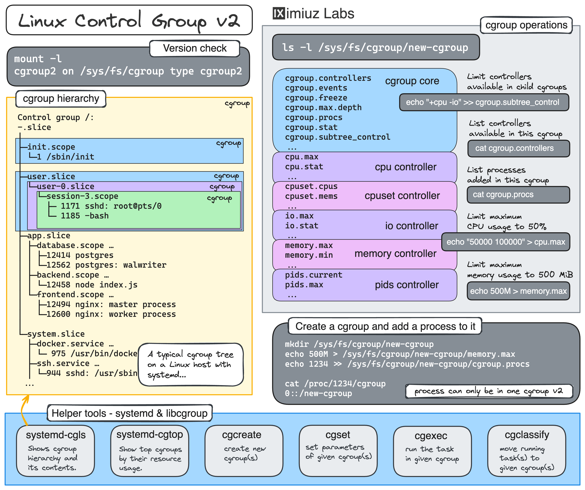

### References:
- https://labs.iximiuz.com/tutorials/controlling-process-resources-with-cgroups

# 🐧 Controlling Process Resources with Linux Control Groups — Complete Practical Guide

This comprehensive guide walks you through controlling process resources using Linux cgroups v2, from the most basic `cgroupfs` manipulation to the handiest `systemd-run` command. Perfect for system administrators, DevOps engineers, and anyone managing resource consumption in multi-tenant environments.

---

## 📚 Table of Contents

1. [What Are cgroups?](#-what-are-cgroups)
2. [Method 1: Manual cgroupfs Manipulation](#-method-1-manual-cgroupfs-manipulation)
3. [Method 2: Using libcgroup Tools](#-method-2-using-libcgroup-tools)
4. [Method 3: Using systemd-run](#-method-3-using-systemd-run)
5. [Method 4: Using systemd Slices](#-method-4-using-systemd-slices)
6. [Practice Challenges](#-practice-challenges)
7. [Quick Reference Cheat Sheet](#-quick-reference-cheat-sheet)

---

## 🎯 What Are cgroups?

**Control Groups (cgroups)** are a Linux kernel feature that allow processes to be organized into hierarchical groups whose usage of various types of resources can then be **limited** and **monitored**.



### Key Concepts

| Concept | Description |
|---------|-------------|
| **cgroupfs** | The kernel's pseudo-filesystem interface for cgroups (mounted at `/sys/fs/cgroup/`) |
| **Controllers** | Resource types that can be managed (cpu, memory, io, pids, etc.) |
| **cgroup.procs** | File containing PIDs of processes in the cgroup |
| **cgroup.subtree_control** | File to enable/disable controllers for child cgroups |
| **OOM Killer** | Out-Of-Memory killer that terminates processes exceeding memory limits |

### Why Use cgroups?

✅ **Protect the system** from resource-hungry processes  
✅ **Ensure fair resource distribution** among multiple applications  
✅ **Test application performance** under constrained resources  
✅ **Guarantee resource availability** in multi-tenant environments  
✅ **Container orchestration** (Docker, Kubernetes use cgroups under the hood)  

---

## 🔧 Method 1: Manual cgroupfs Manipulation

This is the most basic (and labour-intensive) method, manipulating the virtual filesystem directly.

### Step 1: Create a New cgroup

```bash
# Create a new cgroup by making a directory
sudo mkdir /sys/fs/cgroup/hog_pen

# Verify the cgroup was created
ls -la /sys/fs/cgroup/hog_pen
```

### Step 2: Set CPU Limits

```bash
# Limit CPU usage to 50% of a single core
# Format: <cpu_quota> <cpu_period>
# 50000 = 50% of 100000 microseconds (100ms)
# 1000 Microsec = 1 MilliSec
# 1000 Millisec = 1 Sec
echo "50000 100000" | sudo tee /sys/fs/cgroup/hog_pen/cpu.max
```

**Understanding CPU Quota:**

| Quota | Percentage | Meaning |
|-------|------------|---------|
| 25000 | 25% | 25% of one core |
|  50000| 50% | 50% of one core |
| 100000 | 100% | Full core |
| 200000 | 200% | Two full cores |

### Step 3: Set Memory Limits

```bash
# Limit memory usage to 100MB
echo "100M" | sudo tee /sys/fs/cgroup/hog_pen/memory.max
```

**Memory Limit Formats:**

| Format | Value | Meaning |
|--------|-------|---------|
| `100M` | 100,000,000 | 100 Megabytes |
| `1G` | 1,073,741,824 | 1 Gigabyte |
| `524288000` | 524,288,000 | 500 MB in bytes |

### Step 4: Verify Controller Enablement

```bash
# Check available controllers
cat /sys/fs/cgroup/hog_pen/cgroup.controllers
```

**If you get "Permission denied" when writing limits:**

```bash
# Enable controllers in the parent cgroup
echo "+cpu +memory" | sudo tee /sys/fs/cgroup/cgroup.subtree_control

# Now retry setting limits
echo "50000 100000" | sudo tee /sys/fs/cgroup/hog_pen/cpu.max
echo "100M" | sudo tee /sys/fs/cgroup/hog_pen/memory.max
```

### Step 5: Start a Resource-Hungry Process

**Terminal 1: Start the process**

```bash
# Create a simple CPU/memory hog script
cat > ~/hog <<'EOF'
#!/bin/bash
echo "Starting resource hog..."
# Consume CPU
while true; do
  # Allocate memory in chunks
  arr=()
  for i in {1..1000}; do
    arr+=($(head -c 1M /dev/urandom | base64))
  done
  sleep 1
done
EOF

chmod +x ~/hog
~/hog
```

### Step 6: Move Process to cgroup

**Terminal 2: Move the process**

```bash
# Find the PID of the hog process
HOG_PID=$(pgrep -xo hog)
echo "HOG PID: $HOG_PID"

# Move the process to the cgroup
echo ${HOG_PID} | sudo tee /sys/fs/cgroup/hog_pen/cgroup.procs

# Verify the process is in the cgroup
cat /sys/fs/cgroup/hog_pen/cgroup.procs
```

### Step 7: Monitor Resource Usage

```bash
# Monitor CPU usage
watch -n 1 'cat /sys/fs/cgroup/hog_pen/cpu.stat'

# Monitor memory usage
watch -n 1 'cat /sys/fs/cgroup/hog_pen/memory.current'

# Monitor OOM events
watch -n 1 'cat /sys/fs/cgroup/hog_pen/memory.events'
```

### Step 8: Remove the cgroup

```bash
# First, ensure the cgroup is empty
cat /sys/fs/cgroup/hog_pen/cgroup.procs

# If not empty, kill the processes or move them out
sudo kill $(cat /sys/fs/cgroup/hog_pen/cgroup.procs)

# Remove the cgroup
sudo rmdir /sys/fs/cgroup/hog_pen
```

> **Important:** `rm -rf /sys/fs/cgroup/<name>` is NOT a viable command for cgroup deletion. Individual files in the cgroupfs filesystem cannot be deleted, hence the `rmdir` command.

---

## 🛠️ Method 2: Using libcgroup Tools

`libcgroup` provides higher-level tools that simplify cgroup management.

### Installation

```bash
# Debian/Ubuntu
sudo apt-get install cgroup-tools

# RHEL/CentOS 7
sudo yum install libcgroup-tools

# RHEL/CentOS 8/Fedora
sudo dnf install libcgroup-tools
```

### Step 1: Create a cgroup

```bash
# Create cgroup for cpu and memory controllers
sudo cgcreate -g cpu,memory:/hog_pen2
```

### Step 2: Set Limits

```bash
# Set CPU limit to 50%
sudo cgset -r cpu.max="50000 100000" hog_pen2

# Set memory limit to 100MB
sudo cgset -r memory.max="100M" hog_pen2
```

### Step 3: Verify Limits

```bash
# Check CPU limit
cgget -r cpu.max hog_pen2

# Check memory limit
cgget -r memory.max hog_pen2
```

### Step 4: Run Process in cgroup

**Option A: Start process in cgroup directly**

```bash
sudo cgexec -g cpu,memory:hog_pen2 ~/hog
```

**Option B: Move existing process to cgroup**

```bash
# Find PID
HOG_PID=$(pgrep -xo hog)

# Move to cgroup
sudo cgclassify -g cpu,memory:hog_pen2 ${HOG_PID}
```

### Step 5: Remove the cgroup

```bash
sudo cgdelete -g cpu,memory:/hog_pen2
```

---

## ⚙️ Method 3: Using systemd-run

`systemd-run` provides the most convenient way to launch processes with resource constraints.

### Basic Command

```bash
sudo systemd-run -u hog -p CPUQuota=50% -p MemoryMax=100M ~/hog
```

### Parameter Breakdown

| Parameter | Description |
|-----------|-------------|
| `-u hog` | Unit name (creates `hog.service`) |
| `-p CPUQuota=50%` | Limit CPU to 50% of one core |
| `-p MemoryMax=100M` | Limit memory to 100MB |

### Examples

```bash
# Run with 30% CPU and 200MB RAM
sudo systemd-run -u app1 -p CPUQuota=30% -p MemoryMax=200M ~/hog

# Run with 2 cores and 1GB RAM
sudo systemd-run -u app2 -p CPUQuota=200% -p MemoryMax=1G ~/hog

# Run with real-time priority
sudo systemd-run -u app3 -p CPUQuota=50% -p MemoryMax=500M -p CPUWeight=1000 ~/hog
```

### Monitor the Process

```bash
# Check process status
systemctl status hog

# Check cgroup
systemd-cgls

# Check resource usage
systemd-cgtop

# Check logs
journalctl -u hog -f
```

### Clean Up

```bash
# Stop the service
sudo systemctl stop hog

# Reset failed units (if needed)
sudo systemctl reset-failed
```

**Common Error and Fix:**

```
Failed to start transient service unit:
Unit hog.service was already loaded or has a fragment file.
```

**Fix:**
```bash
# Reset failed units
sudo systemctl reset-failed

# Or use the -G flag with systemd-run
sudo systemd-run -G -u hog -p CPUQuota=50% -p MemoryMax=100M ~/hog
```

---

## 🧩 Method 4: Using systemd Slices

Slices create **persistent** cgroups that outlive processes and survive system reboots.

### Step 1: Create a Slice Unit File

```bash
sudo tee /etc/systemd/system/hog_pen.slice <<'EOF'
[Slice]
CPUQuota=50%
MemoryMax=100M
EOF
```

### Step 2: Reload systemd

```bash
sudo systemctl daemon-reload
```

### Step 3: Run Processes in the Slice

```bash
# Run first process
sudo systemd-run -u hog1 --slice=hog_pen.slice ~/hog

# Run second process
sudo systemd-run -u hog2 --slice=hog_pen.slice ~/hog

# Run third process
sudo systemd-run -u hog3 --slice=hog_pen.slice ~/hog
```

### Step 4: Monitor the Slice

```bash
# List all processes in the slice
systemd-cgls hog_pen.slice

# Check resource usage
systemd-cgtop

# Check slice status
systemctl status hog_pen.slice
```

Every process in the `hog_pen.slice` slice will be placed in its own child cgroup, which inherits the resource limits set for the slice. Thus, the cumulative CPU and memory usage of all processes in the hog_pen.slice slice will be limited to 50% CPU and 100MB of memory.

Another great thing about systemd slices is that you can use them to control resources of Docker containers. This is especially useful if you need to tweak a cgroup controller for which there's no docker run flag (e.g., memory.oom.group), or when you want to place multiple Docker containers in the same cgroup, emulating a Kubernetes Pod:


### Step 5: Using with Docker Containers

```bash
# Run containers in the slice
docker run -d --name web --cgroup-parent=hog_pen.slice nginx
docker run -d --name rdb --cgroup-parent=hog_pen.slice redis

# Verify containers are in the slice
systemd-cgls hog_pen.slice
```

```bash
Control group /:
-.slice
├─hog_pen.slice
│ ├─docker-98684060c21bbc18e41f31926265cb092693a20fc169498e48cc2500c19bb646.scope …
│ │ ├─4156 nginx: master process nginx -g daemon off;
│ │ ├─4208 nginx: worker process
│ │ └─4209 nginx: worker process
│ └─docker-c9948bd490491b2719a8614146fb401535f6b1268b07cb430581973f7ea586b7.scope …
│   └─4292 redis-server *:6379
```

### Step 6: Remove the Slice

```bash
# Stop all processes in the slice
sudo systemctl stop hog1 hog2 hog3
sudo docker stop web rdb

# Stop the slice
sudo systemctl stop hog_pen.slice

# Remove the slice file
sudo rm /etc/systemd/system/hog_pen.slice

# Reload systemd
sudo systemctl daemon-reload
```

### Slice vs Scope vs Service

| Unit Type | Purpose | Lifecycle |
|-----------|---------|-----------|
| **Slice** | Organizes processes hierarchically | Persistent until stopped |
| **Scope** | Groups external processes | Managed externally |
| **Service** | Manages system processes | Managed by systemd |

---

## 🏋️ Practice Challenges

### Challenge 1: Manual cgroupfs

Create a cgroup that limits a process to 25% CPU and 50MB memory using manual cgroupfs manipulation.

**Solution:**

```bash
# 1. Create cgroup
sudo mkdir /sys/fs/cgroup/challenge1

# 2. Enable controllers (if needed)
echo "+cpu +memory" | sudo tee /sys/fs/cgroup/cgroup.subtree_control

# 3. Set CPU limit (25%)
echo "25000 100000" | sudo tee /sys/fs/cgroup/challenge1/cpu.max

# 4. Set memory limit (50MB)
echo "50M" | sudo tee /sys/fs/cgroup/challenge1/memory.max

# 5. Run process and move it
~/hog &
HOG_PID=$!
echo ${HOG_PID} | sudo tee /sys/fs/cgroup/challenge1/cgroup.procs

# 6. Verify
cat /sys/fs/cgroup/challenge1/cpu.max
cat /sys/fs/cgroup/challenge1/memory.max
cat /sys/fs/cgroup/challenge1/cgroup.procs
```

---

### Challenge 2: libcgroup

Create the same limits using libcgroup tools.

**Solution:**

```bash
# 1. Create cgroup
sudo cgcreate -g cpu,memory:/challenge2

# 2. Set limits
sudo cgset -r cpu.max="25000 100000" challenge2
sudo cgset -r memory.max="50M" challenge2

# 3. Run process
sudo cgexec -g cpu,memory:challenge2 ~/hog

# 4. Verify
cgget -r cpu.max challenge2
cgget -r memory.max challenge2
```

---

### Challenge 3: systemd-run

Use `systemd-run` to limit a process to 75% CPU and 150MB memory.

**Solution:**

```bash
# 1. Run with limits
sudo systemd-run -u challenge3 -p CPUQuota=75% -p MemoryMax=150M ~/hog

# 2. Verify
systemctl status challenge3
systemd-cgtop | grep challenge3

# 3. Check logs
journalctl -u challenge3 -f
```

---

### Challenge 4: systemd Slice

Create a persistent slice that limits any process in it to 40% CPU and 200MB memory.

**Solution:**

```bash
# 1. Create slice file
sudo tee /etc/systemd/system/challenge4.slice <<'EOF'
[Slice]
CPUQuota=40%
MemoryMax=200M
EOF

# 2. Reload
sudo systemctl daemon-reload

# 3. Run processes
sudo systemd-run -u app1 --slice=challenge4.slice ~/hog
sudo systemd-run -u app2 --slice=challenge4.slice ~/hog

# 4. Verify
systemd-cgls challenge4.slice
systemd-cgtop
```

---

## 📝 Quick Reference Cheat Sheet

### Manual cgroupfs

```bash
# Create
sudo mkdir /sys/fs/cgroup/<name>

# Enable controllers
echo "+cpu +memory" | sudo tee /sys/fs/cgroup/cgroup.subtree_control

# Set limits
echo "50000 100000" | sudo tee /sys/fs/cgroup/<name>/cpu.max
echo "100M" | sudo tee /sys/fs/cgroup/<name>/memory.max

# Add process
echo <PID> | sudo tee /sys/fs/cgroup/<name>/cgroup.procs

# Remove
sudo rmdir /sys/fs/cgroup/<name>
```

### libcgroup

```bash
# Create
sudo cgcreate -g cpu,memory:/<name>

# Set limits
sudo cgset -r cpu.max="50000 100000" <name>
sudo cgset -r memory.max="100M" <name>

# Run process
sudo cgexec -g cpu,memory:<name> <command>

# Remove
sudo cgdelete -g cpu,memory:/<name>
```

### systemd-run

```bash
# Run with limits
sudo systemd-run -u <unit> -p CPUQuota=50% -p MemoryMax=100M <command>

# Check status
systemctl status <unit>

# Remove
sudo systemctl stop <unit>
sudo systemctl reset-failed
```

### systemd Slice

```bash
# Create slice file
sudo tee /etc/systemd/system/<name>.slice <<'EOF'
[Slice]
CPUQuota=50%
MemoryMax=100M
EOF

# Reload
sudo systemctl daemon-reload

# Run in slice
sudo systemd-run --slice=<name>.slice <command>

# Remove
sudo rm /etc/systemd/system/<name>.slice
sudo systemctl daemon-reload
```

---

## 🏆 Summary

| Method | Complexity | Best For |
|--------|------------|----------|
| **Manual cgroupfs** | High | Learning, debugging, low-level control |
| **libcgroup** | Medium | Scripting, older systems |
| **systemd-run** | Low | Quick resource limits for commands |
| **systemd Slice** | Low | Persistent resource limits, multi-process |

### Key Takeaways

✅ **cgroups** limit CPU and memory for processes  
✅ **cgroupfs** is the low-level interface  
✅ **systemd** is the recommended manager on modern Linux  
✅ **OOM Killer** terminates processes exceeding memory limits  
✅ **Slices** provide persistent cgroups for multiple processes  

---

**"With great power comes great responsibility — use cgroups wisely!"** 🚀